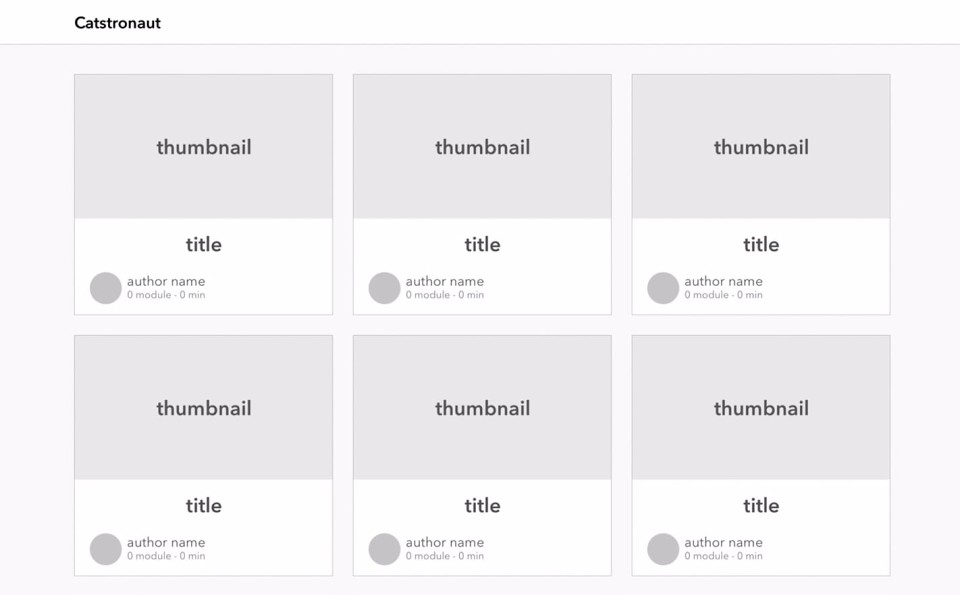
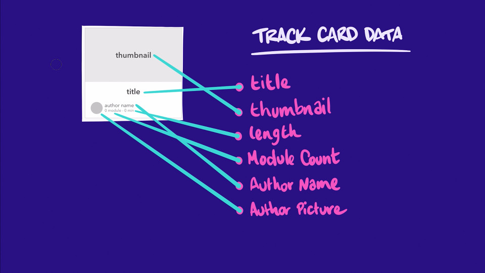
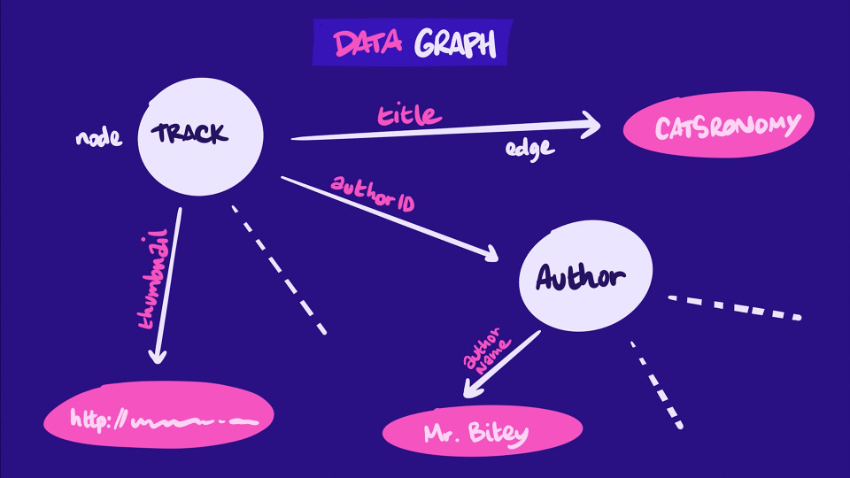
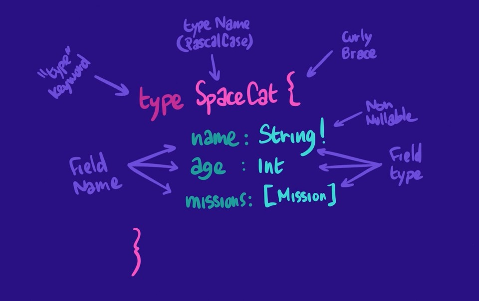

# ❤ Notes ❤

This project is developed using a `schema-first` design

That means that we'll implement the feature based on exactly which data our client app needs

This involves 3 major steps:

- **Defining the Schema**: we identify which data will be required, and we structure our schema to provide that data as intuitively as possible

- **Back-end Impl**: we develop the backend

- **Front-end Impl**: the client consumes the data from the backend

This desing allows the front and the back-end to be developed in parallel using mocked-data that follows the defined schema, and this will be perfect for learning Graphql

## What data do we need to build our feature?



Data neded based on the mockup:


```ts
// my answer
// neraly got it perfect, i named the estimated duration `min` intead of `length`

interface Card {
  title: string;
  thumbnail: string;
  length: number; // estimated duration
  moduleCount: number;
  author: {
    name: string;
    picture: string;
  };
}
```



## Data Graph

We can start to think about our app's data as a collection of objects (such as learning tracks and authors) and relationships between objects (such as each learning track having an author)

If we think of each object as a node and each relationship as an edge between two nodes, we can think of our entire data model as a graph of nodes and edges. This is called our application's data graph.

Here's an incomplete representation of our application's data graph, based entirely on our mockup's data requirements:



## GraphQL Schema

A schema is like a contract between the server and the client. It defines what a GraphQL API can and can't do, and how clients can request or change data. It's an abstraction layer that provides flexibility to consumers while hiding back-end implementation details.

### GraphQL's Schema Definition Language / GQL SLD

A schema is a collection of Objects that contain fields. Each field has a type of its own.

A field's type can be a scalar, like a Int or a String, or another object, like the Author of our Track

```ts
// type defines a schema
// and its name, as a best practice, should be in PascalCase
type SpaceCat {
  // here we add our fileds
  // just write the name(camelCase): type(scalar or object)
  age: Int
  missions: [Mission] // on ts will be Mission[]
}
```

Unlike Javascript objects (which look very similar), fields are not separated by commas. In addition, we can indicate whether each field value is nullable or non-nullable. If a field should never be null, we add an exclamation mark after its type

Visual explanation:



It's good practice to document your schema, in the same way that it's helpful to comment your code. It makes it easier for your teammates (and future you) to make sense of what's going on. It also allows tools like the Apollo Studio Explorer to guide API consumers on what they can achieve with your API right when and where they need it.

To do that, the SDL lets you add descriptions to both types and fields by writing strings (in quotation marks) directly above them.

```gql
"Adventurous Feline exploring the universe!"
type SpaceCat {
  """name of our hero!
  
  TO THE MOON!
  """
  name: String!
  age: Int
  missions: [Mission]
}
```

## Apollo GraphQL

### Creating a Schema from js

```js
const { gql } = require('apollo-server')

const typeDefs = gql`
  # here we can define the gql schema
  # type Query needs to be defined
`

module.exports = typeDefs
```

### Mocked Data

while our app is been developed some parts may not be implemented yet, a way to allow the front-end to be developed widout needing to end the back-end is by using mocked data

doing this with apollo is extremely easy, just set `mocks` to `true` when creating the `ApolloServer`

if you want more controll over the mocked data is possible to supply our own mocks, to do that we just need to supply a object with the types as functions that return a object with each property that we want to customize set to a function that returns the desidered value

```js
const mocks = {
  Query: () => ({
    tracksForHome: () => [...new Array(6)]
  }),
  Track: () => ({
    title: () => "Astro Kitty, Space Explorer",
    thumbnail: () => "https://res.cloudinary.com/dety84pbu/image/upload/v1598465568/nebula_cat_djkt9r.jpg",
    length: () => 1210,
    modulesCount: () => 6,
  }),
  Author: () => ({
    name: "Grumpy Cat",
    photo: "https://res.cloudinary.com/dety84pbu/image/upload/v1606816219/kitty-veyron-sm_mctf3c.jpg",
  })
};

const server = new ApolloServer({ typeDefs, mocks });
```
