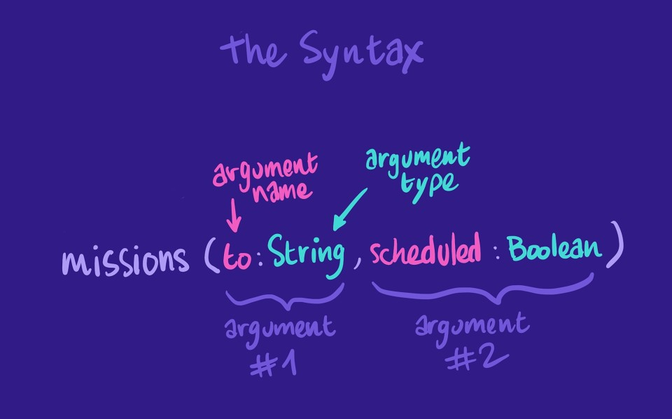
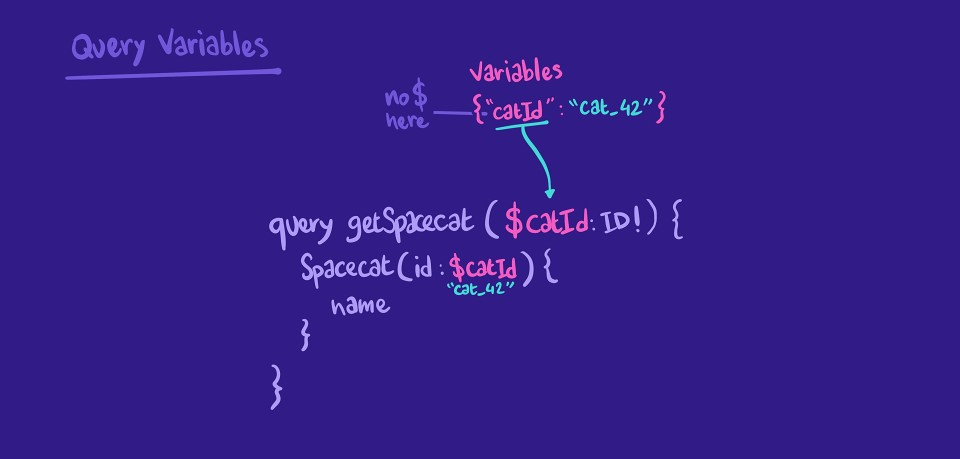

## Entrypoint Arguments



## How Types Work (in my understanding)

For each required field on our query, apollo calls a respective resolver

But it also happens for fields of our types

But we have implemented (most of them at least), so appears that the default impl is something like:

```js
field(parent) {
  return parent['field'];
}
```

What means is that all fields can be overriden and virtual ones can be easily created

And lazy fields too!

AND I LOVE IT

## Variables



## useQuery with variables

It's pretty easy, just add a second arg as a object with a variables key set to a object with all te variables

```js
const { loading, error, data } = useQuery(GET_TRACK, {
  variables: {
    trackId: "c_5",
  },
});
```
