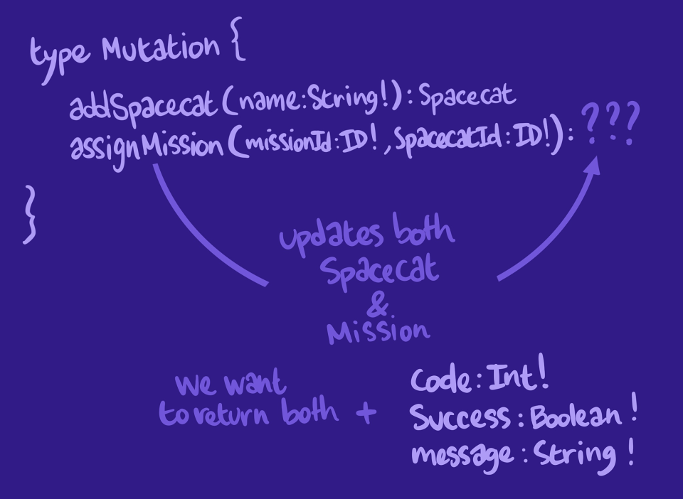

## Mutations

Mutations are any write operation

Creating a user, changing his photo, deleting a post are all mutations

They are defined into the type `Mutation` into our schema

```gql
type Mutation {
  addView(): Int!
  createUser(user: UserInput): User!
}
```

Naming

> We recommend starting with a verb that describes the specific action of our update operation (such as add, delete, or create), followed by whatever data the mutation acts on. Because mutations typically modify a specific object, they often require arguments. We can add arguments as needed, following the same SDL syntax. The return type of the mutation comes after the colon.

> For the mutation response, we should return the data that the mutation updated, so that our client can update its UI without having to run a followup query

## Multiple Mutated Objects

When a mutation updates more than just one object, how do we pick which one to return?

A spacecat has a list of missions they've been assigned to. A mission can also have more than one spacecat assigned to it, like a crew. We want to create a mutation called assignMission that assigns one spacecat to a particular mission. This would update that spacecat's list of missions, and it would also update a mission's list of crew members.



In addition, we'll need to account for any partial errors that might occur and return helpful information to the client. We recommend adding 3 common fields to all mutation responses:

- `code`: an Int that refers to the status of the response, similar to an HTTP status code.

- `success`: a Boolean flag that indicates whether all the updates the mutation was responsible for succeeded.

- `message`: a String to display information about the result of the mutation on the client side. This is particularly useful if the mutation was only partially successful and a generic error message can't tell the whole story.

Circling back to the assignMission mutation, we're going to create a new type specifically for its response. By convention, this return type will start with the name of the mutation (AssignMission) and end with Response. This type will contain the three informational properties, as well as additional fields for each object that the mutation updated.

```gql
type AssignMissionResponse {
  code: Int!
  success: Boolean!
  message: String!
  spacecat: Spacecat
  Mission: Mission
}
```

## useMutation

When running a mutation we will need to use the useMutation hook

This method retuns an array containing

- `0`: the function that triggers the mutation
- `1`: the object that we already know with the `loading`, `error` and `data` fields

## ✨ Magic Update ✨

If we do a mutation and get back the id of the type plus the updated field(s) apollo will update the cache with this new data and this will cause a update on the UI, even if we haven't added any code for this to happen

The cache regenerates and our UI regenerates together
